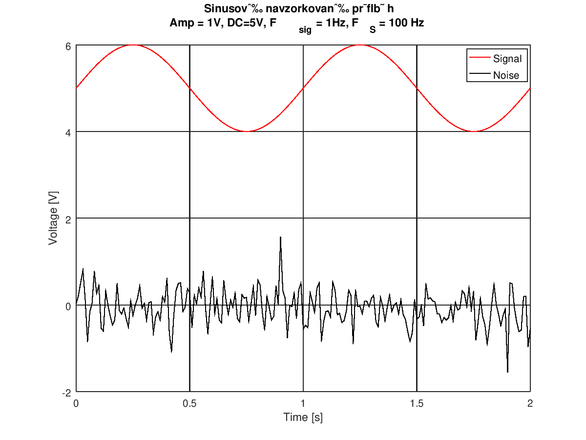
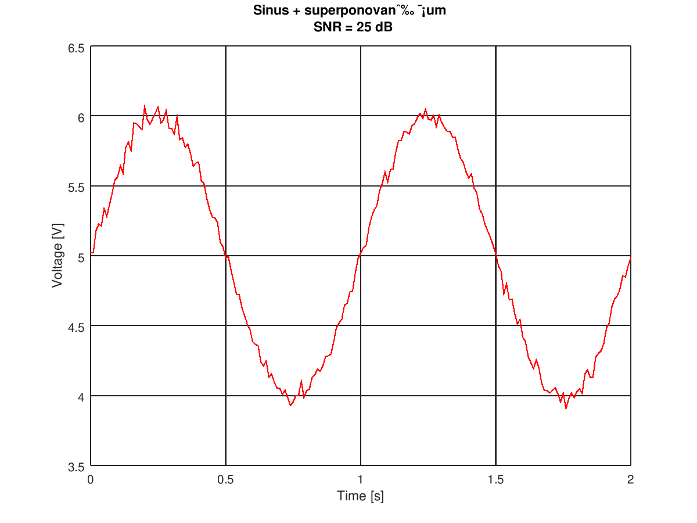
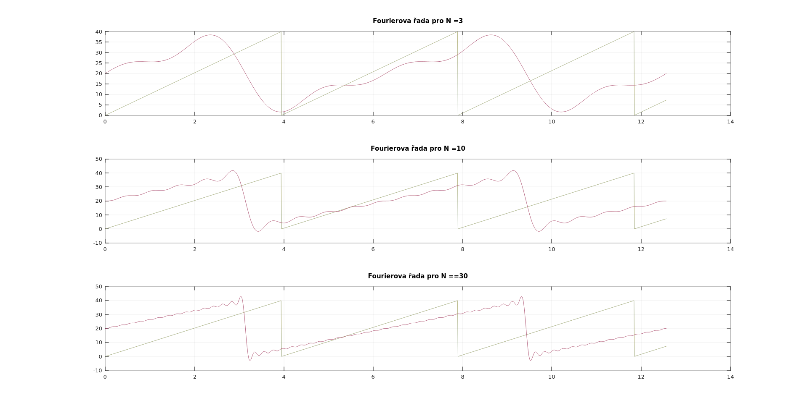

# Checklist hotoveho - TODO

## Signal generation in Matlab - part 1

- ***Done***
  

## Signal generation in Matlab - part 2

- ***Done***
  
  

## Signal characteristics

- ***Done***
  
  
  

## Signal to noise ratio practice

- ***Done***
  
  

## Stochastic signal

- ***Done***
  

## Linear convolution

- ***Done***
  
  
  

## Fourier series

- Dodělat
- Asi budu muset přepsat alg.
  - Problém s fázovým posuvem
  - Možná problém, že to beru jako komplexní
  - Nějak to došudlit
- Výpis koeficientů do tabulky, nebo ***sprintf-em***
  

## Discrete Fourier transform (DFT)

- Dodělat komplet
